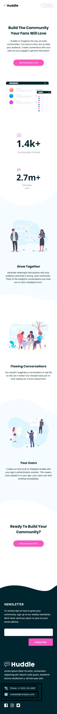

# Frontend Mentor - Huddle landing page with curved sections solution

This is a solution to the [Huddle landing page with curved sections challenge on Frontend Mentor](https://www.frontendmentor.io/challenges/huddle-landing-page-with-curved-sections-5ca5ecd01e82137ec91a50f2). Frontend Mentor challenges help you improve your coding skills by building realistic projects. 


### The challenge

Users should be able to:

- View the optimal layout for the site depending on their device's screen size
- See hover states for all interactive elements on the page

### Screenshot

## Mobile

## Desktop

### active


## My process
My first contact with Sass, I understand that I did bad practices, I used features where I shouldn't but those errors are what now make me better understand how to exploit the full potential of this sde css preprocessor, and at the same time in this project I use javascript for the first time.
### Built with

- Semantic HTML5 markup
- SCSS custom properties
- Flexbox
- JavaScript
- Mobile-first workflow

 

### What I learned

The use of mixins and partials is what was complicated for me since I did not know how to take advantage of the potential of Sass, but nevertheless with the sole fact of being able to nest child elements to their parents


the practice of making the responsive part in the same element is also something new, I know it can be done better with mixins


In this challenge I wanted to make the content flexible, since in the previous ones that I had done there were only two resolutions and surfing the internet I realized that you don't see that much, so I started testing and well I realized the functionalities by max-width

````scss
body{
  
    font-family: var.$font-body;
    display: flex;
    flex-direction: column;
    align-items: center;
    justify-content: center;
    
    
    min-width: 280px;
    margin: auto;
    max-width: 1900px;
    
    
}
```


```scss
.header{
    
    width: 100%;
    width: 88%;
    
    margin: 30px 0 150px;
    @media (min-width:1200px) {
        width: 100%;
       
        
    }
    &__nav{

        
        display: flex;
        justify-content: space-between;
        align-items: center;
        @media (min-width:1200px) {
            padding: 10px 200px;
            
        }
        &__logo{

            width: 100px;
            height: 18px;
            /* BETA */
            @media (min-width:1200px) {
                width: 241px;
                height: 41px;
                
            }
        }

        &__btn{

            @include mixins.btn(90px,25px,unset,var.$Pink);
            box-shadow: unset;
            &:hover{
                background-color: unset;
                border-color: var.$LightPink;
                color: var.$LightPink;;
            }
            

            /* BETA */
            @media (min-width:1200px) {
                width: 141px;
                height: 41px;
                border-radius: 60px;
                
            }
        }
    }

}
````
Lo que he probado también en este desafio es el tema del responsive ya que el desafio e da dos dimensiones pero yo he visto en algunas paginas que esto no es estatico entonces pense que tal vez no estoy usando el potencial de la caja flexible, entonces empece a probar y a probar, y ahora que he terminado, repaso loque hice, y lo que note es que a los contenedores les dí un tamaño porcentual, y a los elementos si les dí un tamaño estatico, bueno a la mayoria como botones, pero bueno a segur practicando, también le deje a las secciones un "min-height:100vh" para qye cada sección se vea en la pantalla pienso y es obvio de que hay mejores maneras pero bueno esta es la que se me ocurre con los conocimientos que tengo hasta el momento. 

## Author

- Website - [Luis Jimenez](https://github.com/LuisJimenez19)
- Frontend Mentor - [@LuisJimenez19](https://www.frontendmentor.io/profile/LuisJimenez19)


